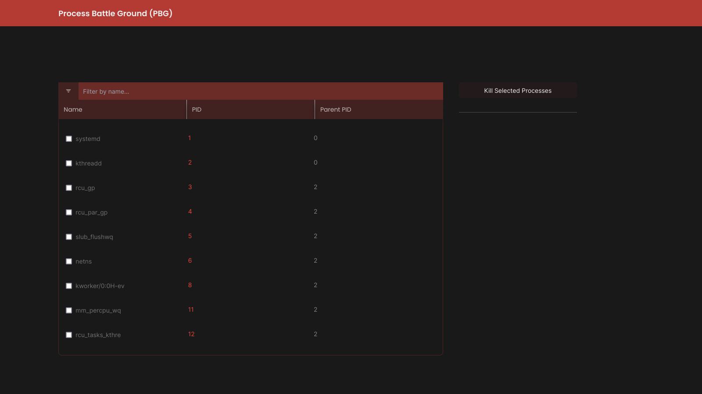

# PBG



Process battleground 😉 is a web app to help kill processes from your web browser...

## Acknowlegments

The original web app (project) was built in Go and other technologies by Ayodeji. I just tried having fun with my learnings on typescript, nodejs and react...

- [Ayodeji (Bazooka)](https://github.com/aosasona/bazooka)

## Installation

PBG was compiled into an executable binary file but it came out large, over 100mb.

### Requirement

- NodeJS
- Concurrently (Install With Command Below)

```
npm install -g concurrently
```

---

- Clone this repo

```
git clone https://github.com/somtodev/pbg.git
cd pbg
```

- Get Backend & Client Dependecies

```
npm run load
```

- Loadup Application

```
npm start
```

##### Contribute

Do you find a bug or something that could be done better ? Sure, Drop a pull request :)
